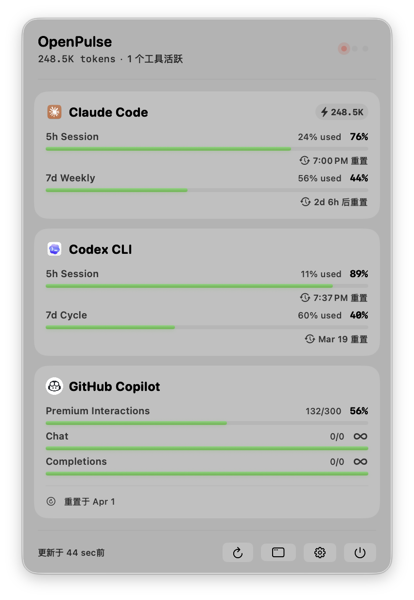
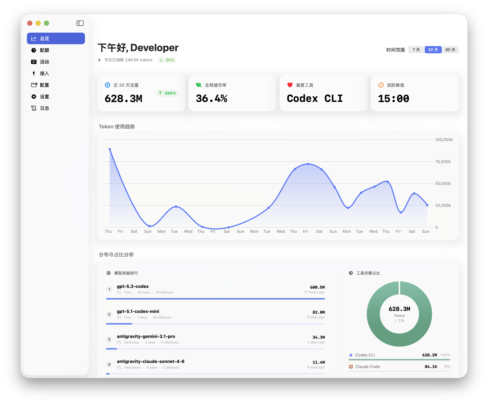
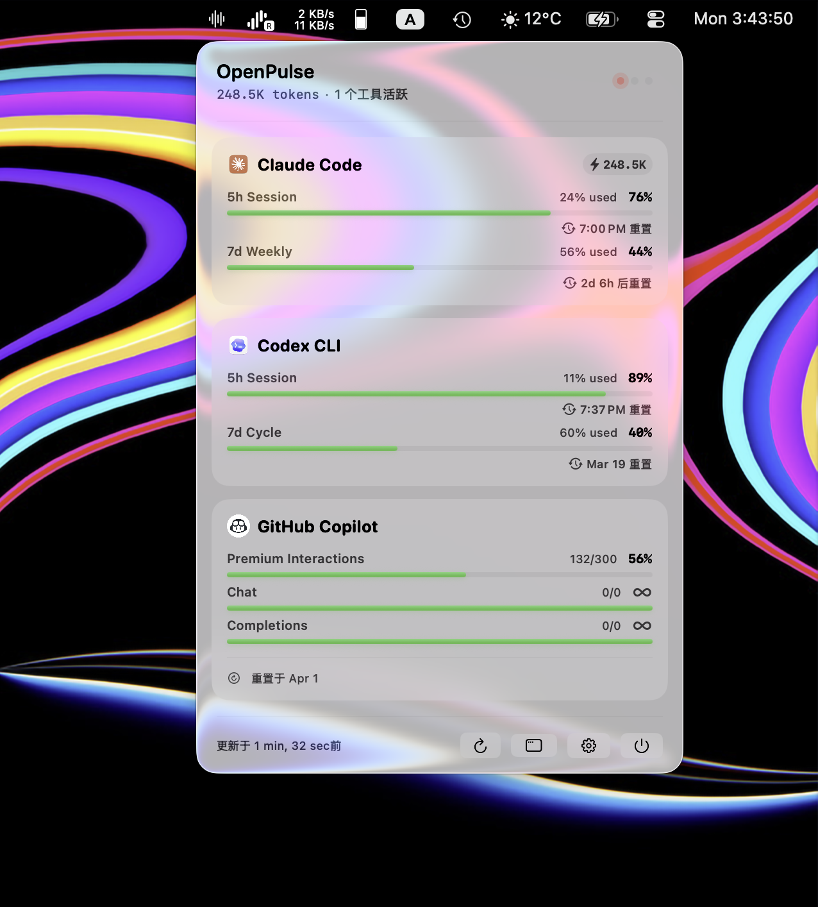
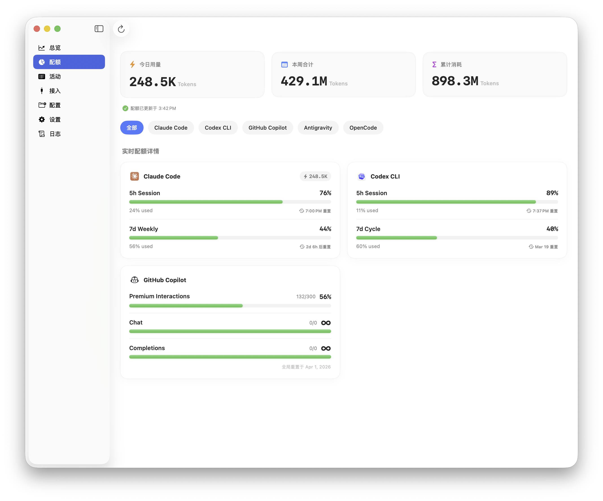

# OpenPulse

A native macOS menu bar app that unifies token consumption and quota tracking across AI coding assistants: Claude Code, Codex, GitHub Copilot, and Gemini Code Assist.

## Installation

### Option 1: Download Release (Recommended)

Download **OpenPulse-1.0.dmg** from [GitHub Releases](https://github.com/fanyu/OpenPulse/releases):

1. Download `OpenPulse-1.0.dmg`
2. Open the DMG and drag **OpenPulse.app** to Applications
3. On first launch, right-click → **Open** to bypass Gatekeeper

**Requirements**: macOS 26 (Tahoe) or later

### Option 2: Build from Source

```bash
git clone https://github.com/fanyu/OpenPulse.git
cd OpenPulse
xcodegen generate
xcodebuild -project OpenPulse.xcodeproj -scheme OpenPulse -configuration Release build
```

---

| Menu Bar Popover | Dashboard — Trends |
|:---:|:---:|
|  |  |
| **In Context** | **Dashboard — Quota** |
|  |  |

## Highlights

- Track sessions, token usage, and quota across multiple AI coding assistants in one native macOS app.
- Codex supports multi-account import, OpenAI OAuth login, per-account quota monitoring, and menu bar account switching.
- Optional Codex smart switching can automatically move to a better account when the current 5h or 7d window is exhausted, then relaunch Codex.
- Native `NSStatusItem` menu bar integration with a compact popover, custom status icon, and optional two-line Codex / Claude remaining quota summary.
- Granular menu bar settings for tool visibility, ordering, refresh intervals, direct title quota display, global hotkey, and launch at login.
- Built-in provider management, local config file browser/editor, runtime log viewer, low-quota notifications, and Dot Text API quota sync.

## Supported Tools

| Tool | Integration | What It Tracks |
|------|-------------|----------------|
| **Claude Code** | Local JSONL files (`~/.claude/projects/`) | Sessions, tokens (input/output/cache), model, git context |
| **Codex** | Local SQLite + OpenAI OAuth + local multi-account store | Sessions, token usage, per-account 5h / 7d quota, account switching |
| **GitHub Copilot** | GitHub internal API | Quota remaining, reset time |
| **Gemini Code Assist** (Antigravity) | Local markdown + Google OAuth API | Sessions, quota |
| **OpenCode** | Local files | Sessions, token usage |

## Requirements

- macOS 26 (Tahoe) or later
- Xcode 26 or later
- [XcodeGen](https://github.com/yonaskolb/XcodeGen) (`brew install xcodegen`)

## Build & Run

```bash
# Clone the repo
git clone https://github.com/your-username/OpenPulse.git
cd OpenPulse

# Generate the Xcode project
xcodegen generate

# Open in Xcode and run
open OpenPulse.xcodeproj
```

Before building, set your own Apple Developer Team ID in `project.yml`:

```yaml
DEVELOPMENT_TEAM: "YOUR_TEAM_ID"
```

Find your Team ID at [developer.apple.com/account](https://developer.apple.com/account) under Membership.

## Tool Setup

### Claude Code
No setup required. OpenPulse reads `~/.claude/projects/` automatically.

### Codex
OpenPulse reads `~/.codex/state_5.sqlite` automatically for local session history, and also supports Codex multi-account management.

Features:

- Import the current `~/.codex/auth.json`
- Add additional Codex accounts via OpenAI OAuth login
- Monitor each account's 5h and 7d quota windows
- Switch the current Codex account from the dashboard or menu bar
- Relaunch Codex automatically after account switching
- Enable optional smart switching from Settings so OpenPulse can automatically switch to a better account when the current one is exhausted

Notes:

- Multi-account credentials are stored locally on the Mac in `~/.openpulse/codex-accounts.json`
- Codex session history still comes from the currently active local Codex state, so quota monitoring is multi-account but local session history is still tied to the current account
- In multi-account setups, OpenPulse now prefers per-account API quota refresh results and will not use ambiguous local session JSONL quota snapshots to overwrite the selected account

### GitHub Copilot
OpenPulse reads your existing Copilot credentials from `~/.config/github-copilot/`. Sign in to Copilot in VS Code or the GitHub CLI first.

### Gemini Code Assist (Antigravity)
OpenPulse reads session data from `~/.gemini/antigravity/brain/` and uses Google OAuth (via the Antigravity CLI credentials) to fetch quota. Install and authenticate the [Antigravity CLI](https://github.com/nguyenphutrong/quotio) first.

### OpenCode
No setup required. OpenPulse reads OpenCode's local state automatically.

## App Features

### Menu Bar

- Native status bar item powered by `NSStatusItem`, with a custom-drawn icon + text layout
- Optional direct menu bar quota display for Codex and Claude Code
- Two-line compact summary mode for 5h / 7d remaining quota
- Manual refresh, open main window, open Settings, and quit shortcuts from the popover
- Global keyboard shortcut to toggle the menu bar popover

### Dashboard

- Seven main sections: Quota, Activity, Trends, Providers, Configs, Settings, and Logs
- Quota cards for all supported tools, including Codex multi-account and Antigravity multi-account layouts
- Token trends, daily aggregates, tool comparisons, and session activity history
- Provider-specific setup surfaces for Codex account management and Copilot credential import
- Local config file editor with diff view and preview modes for supported tool config files
- In-app runtime log viewer backed by a persistent rolling log store

### Settings

- Launch at login
- Menu bar tool ordering and visibility
- Per-tool sync interval or global sync interval
- Direct menu bar quota display selection for Codex / Claude
- Global hotkey recording
- Codex smart switch toggle
- Dot Text API device ID / task key / API key configuration
- Low-quota notifications with configurable threshold

## Architecture

```text
NSStatusItem + NSPopover          MainWindow (dashboard)
            │                               │
            └──────────── AppStore ─────────┘
                              │
                       DataSyncService
                       ┌──────┼──────────────┐
                 Parsers (actors, one per tool)
                       │
         SessionRecord / QuotaRecord / DailyStatsRecord
                       │
                  SwiftData → @Query views
```

- **Parsers** are Swift `actor`s — thread-safe, no locks needed.
- **DataSyncService** manages FSEvents watchers (local files), polling timers (APIs), Codex multi-account quota refresh, notifications, and Dot Text API quota pushes.
- **KeychainService** is the only place credentials are stored (`com.fanyu.openpulse`).
- No ViewModels — views query SwiftData directly via `@Query`.

See [`CLAUDE.md`](CLAUDE.md) for detailed architecture docs.

## Contributing

1. Fork and clone the repo.
2. Run `xcodegen generate` to create the Xcode project.
3. Set your `DEVELOPMENT_TEAM` in `project.yml`.
4. Make your change in a focused branch.
5. Open a pull request.

To add support for a new tool, see the "Adding a New Tool" section in [`CLAUDE.md`](CLAUDE.md).

## License

MIT

---

# OpenPulse 中文

[English](#openpulse) | 中文

一款原生 macOS 菜单栏应用，统一追踪多款 AI 编程助手的 Token 消耗与配额。

| 菜单栏弹窗 | 主面板 · 趋势 |
|:---:|:---:|
|  |  |
| **桌面环境** | **主面板 · 配额** |
|  |  |

## 功能亮点

- 用一款原生 macOS 应用统一查看多种 AI 编程助手的会话、Token 用量和配额。
- Codex 支持多账户导入、OpenAI OAuth 登录、按账户额度监测，以及菜单栏内直接切换账号。
- 可选开启 Codex 智能切换：当当前账号的 5h 或 7d 配额耗尽时，自动切到更优账号并重启 Codex。
- 基于原生 `NSStatusItem` 的菜单栏体验，支持自定义状态图标和可选的 Codex / Claude 两行额度摘要。
- 提供完整的菜单栏设置：工具显示顺序、显隐、刷新频率、直接显示额度、全局快捷键、开机启动。
- 内置接入管理、配置文件浏览/编辑、运行日志查看、低额度通知，以及 Dot Text API 配额同步。

## 支持的工具

| 工具 | 接入方式 | 追踪内容 |
|------|----------|----------|
| **Claude Code** | 本地 JSONL 文件（`~/.claude/projects/`）| 会话、Token（输入/输出/缓存）、模型、Git 信息 |
| **Codex** | 本地 SQLite + OpenAI OAuth + 本地多账户仓库 | 会话、Token 用量、按账户 5h / 7d 配额、账号切换 |
| **GitHub Copilot** | GitHub 内部 API | 剩余配额、重置时间 |
| **Gemini Code Assist**（Antigravity）| 本地 markdown + Google OAuth API | 会话、配额 |
| **OpenCode** | 本地文件 | 会话、Token 用量 |

## 环境要求

- macOS 26（Tahoe）或更高版本
- Xcode 26 或更高版本
- [XcodeGen](https://github.com/yonaskolb/XcodeGen)（`brew install xcodegen`）

## 构建与运行

```bash
# 克隆仓库
git clone https://github.com/your-username/OpenPulse.git
cd OpenPulse

# 生成 Xcode 项目
xcodegen generate

# 用 Xcode 打开并运行
open OpenPulse.xcodeproj
```

构建前，在 `project.yml` 中填写你自己的 Apple Developer Team ID：

```yaml
DEVELOPMENT_TEAM: "YOUR_TEAM_ID"
```

Team ID 可在 [developer.apple.com/account](https://developer.apple.com/account) 的 Membership 页面查到。

## 各工具配置

### Claude Code
无需额外配置，OpenPulse 自动读取 `~/.claude/projects/`。

### Codex
OpenPulse 会自动读取 `~/.codex/state_5.sqlite` 获取本地会话历史，同时支持 Codex 多账户管理。

支持内容：

- 导入当前 `~/.codex/auth.json`
- 通过 OpenAI OAuth 新增多个 Codex 账号
- 监测每个账号的 5h 与 7d 配额窗口
- 在主面板或菜单栏中切换当前 Codex 账号
- 切换账号后自动重启 Codex
- 可在设置中开启智能切换，在当前账号额度耗尽时自动切到更优账号

说明：

- 多账户认证信息只保存在本机的 `~/.openpulse/codex-accounts.json`
- Codex 会话历史仍来自当前本机正在使用的本地状态，因此多账户完整覆盖的是额度监测与账号切换；本地会话历史仍对应当前账号
- 在多账户场景下，OpenPulse 现在优先信任按账户拉取的 API 配额结果，不再用无法确认账号归属的本地 JSONL 配额快照覆盖当前账号

### GitHub Copilot
OpenPulse 从 `~/.config/github-copilot/` 读取已有的 Copilot 凭据。请先在 VS Code 或 GitHub CLI 中登录 Copilot。

### Gemini Code Assist（Antigravity）
OpenPulse 从 `~/.gemini/antigravity/brain/` 读取会话数据，并通过 Google OAuth（使用 Antigravity CLI 的应用凭据）拉取配额。请先安装并登录 [Antigravity CLI](https://github.com/nguyenphutrong/quotio)。

### OpenCode
无需额外配置，OpenPulse 自动读取 OpenCode 的本地状态。

## 应用功能

### 菜单栏

- 基于 `NSStatusItem` 的原生状态栏入口，使用自定义 icon + 文本布局
- 支持将 Codex / Claude 的剩余额度直接显示在菜单栏
- 支持两行紧凑模式展示 5h / 7d 剩余额度
- 菜单栏弹窗内可直接刷新、打开主窗口、打开设置、退出应用
- 支持全局快捷键呼出菜单栏弹窗

### 主面板

- 提供 7 个主模块：配额、活动、趋势、接入、配置、设置、日志
- 覆盖所有支持工具的配额卡片，包括 Codex 多账户和 Antigravity 多账户展示
- 支持 Token 趋势、每日聚合、工具对比和会话历史
- 提供 Codex 账户管理、Copilot 凭据导入等接入管理能力
- 内置本地配置文件浏览/编辑器，支持 diff 和预览模式
- 内置运行日志查看器，使用持久化滚动日志存储

### 设置

- 开机自动启动
- 菜单栏工具排序与显隐
- 全局或按工具设置同步频率
- 选择菜单栏直接显示额度的 Agent
- 全局快捷键录制
- Codex 智能切换开关
- Dot Text API 的 Device ID / Task Key / API Key 配置
- 低额度通知与阈值设置

## 架构简介

```text
NSStatusItem + NSPopover          MainWindow（主面板）
            │                               │
            └──────────── AppStore ─────────┘
                              │
                       DataSyncService
                       ┌──────┼──────────────┐
                 Parsers（actor，每个工具一个）
                       │
         SessionRecord / QuotaRecord / DailyStatsRecord
                       │
                  SwiftData → @Query 视图
```

- **Parsers** 使用 Swift `actor`，天然线程安全，无需加锁。
- **DataSyncService** 同时管理本地文件 FSEvents 监听、API 轮询、Codex 多账户额度刷新、通知以及 Dot Text API 推送。
- **KeychainService** 是唯一存储凭据的地方（`com.fanyu.openpulse`）。
- 无 ViewModel，视图直接通过 `@Query` 查询 SwiftData。

详细架构文档见 [`CLAUDE.md`](CLAUDE.md)。

## 参与贡献

1. Fork 并克隆仓库。
2. 执行 `xcodegen generate` 生成 Xcode 项目。
3. 在 `project.yml` 中设置你的 `DEVELOPMENT_TEAM`。
4. 在独立分支上完成修改。
5. 提交 Pull Request。

如需新增工具支持，参见 [`CLAUDE.md`](CLAUDE.md) 中的「Adding a New Tool」章节。

## 许可证

MIT
