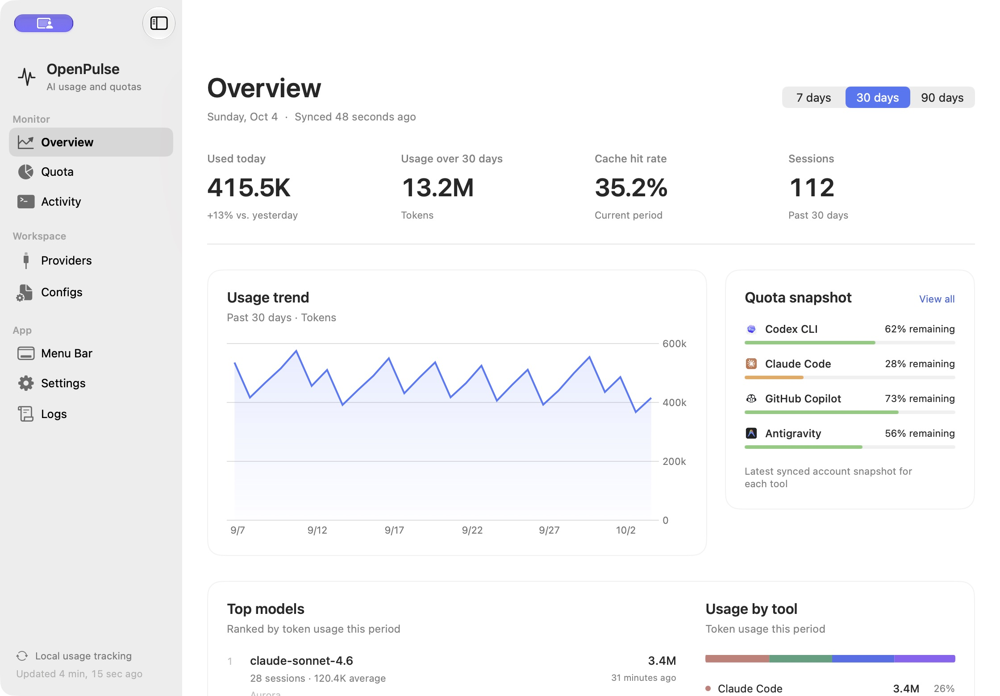
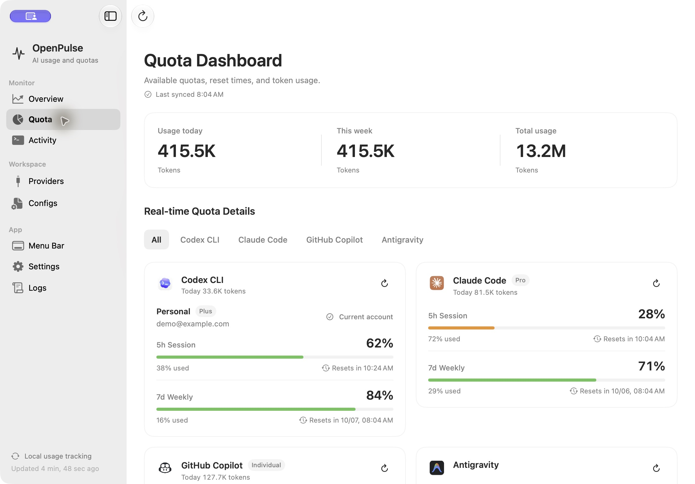
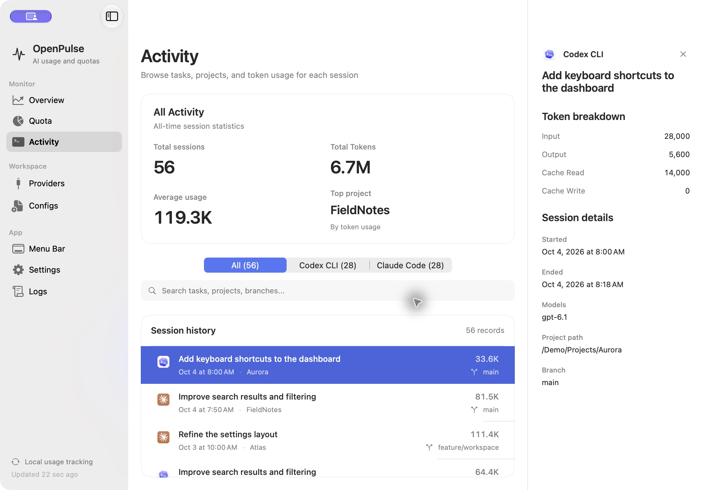
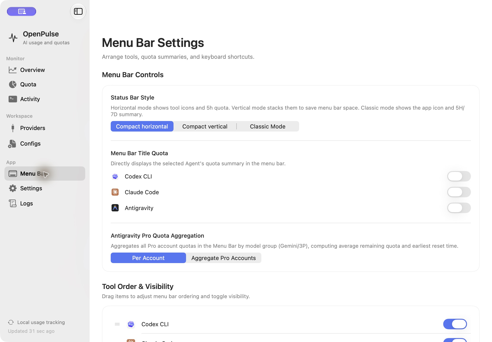
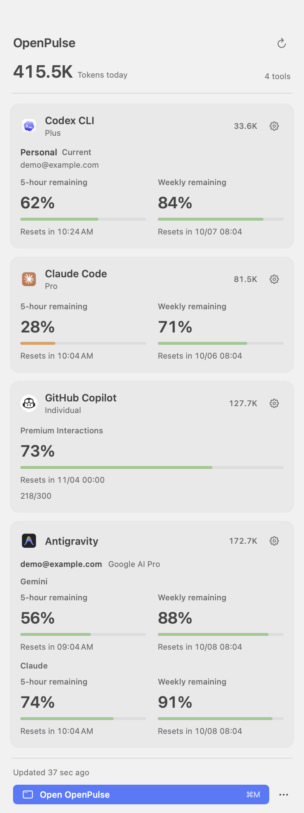

# OpenPulse

[English](#openpulse) · [简体中文](#openpulse-中文)

A native macOS menu bar app for AI coding usage and quotas. Keep Claude Code, Codex, GitHub Copilot, and Antigravity in one place, with local session history and a dashboard built for everyday monitoring.

**OpenPulse 2.0** redesigns all eight dashboard pages and the menu bar popover, improves usage import and refresh reliability, and moves saved Codex authorization into Keychain. See the [2.0 release notes](docs/releases/v2.0.0.md).



| Quota | Activity |
|:---:|:---:|
|  |  |
| **Menu bar settings** | **Menu bar popover** |
|  |  |

The macOS screenshots use fictional demo data.

## What you can do

- See today's tokens, usage trends, cache usage, activity patterns, and model/project breakdowns in **Overview**.
- Monitor account quotas, reset times, and unknown or stale observations in **Quota**.
- Search local sessions and inspect token counts, models, working directories, and Git context in **Activity**. Search covers the full history while rows load in batches.
- Choose menu bar styles, tool visibility/order, quota summaries, and a global shortcut in **Menu Bar**.
- Manage Codex and Antigravity accounts, Copilot authorization, and Codex providers/model routing in **Providers**.
- Edit supported local configuration and rule files with Markdown preview, diffs, backups, and external-change checks in **Configs**.
- Configure refresh intervals, launch at login, low-quota notifications, and optional Dot Text API quota pushes in **Settings**; inspect refresh and error messages in **Logs**.

Codex supports importing the current account, OpenAI OAuth login, per-account 5h/7d quotas, and manual switching with a Codex restart. Optional smart switching requires recent, successful quota observations and confirmed exhaustion. Inactive accounts do not yet automatically renew expired authorization; reauthenticate or import fresh authorization when needed.

## Supported tools and setup

| Tool | Data and setup | Available information |
|---|---|---|
| **Claude Code** | Reads `~/.claude/projects/` and `~/.config/claude/projects/`; quota sources include the local Claude bridge, Claude Desktop, and Claude OAuth | Sessions, input/output/cache tokens, model, Git context, quota windows |
| **Codex** | Reads `~/.codex/state_5.sqlite`; import `~/.codex/auth.json` or add an OpenAI login in Providers | Local sessions and tokens, per-account quota windows, account switching |
| **GitHub Copilot** | Import `~/.cli-proxy-api/github-copilot-*.json` or save and validate an OAuth token in Providers | API quota snapshots and reset time |
| **Antigravity** (Gemini Code Assist) | Reads `~/.gemini/antigravity/brain/`; add a Google login in Providers or use `~/.cli-proxy-api/antigravity-*.json` | Local tasks and per-account quota groups |

Available fields depend on the tool's local records and API response. Codex local history comes from this Mac's state; it is not a separate history import for every saved account.

## Installation

Requires **macOS 26 or later**.

1. Download `OpenPulse-2.0.0.zip` from [GitHub Releases](https://github.com/fanyu/OpenPulse/releases).
2. Extract the ZIP and move **OpenPulse.app** to **Applications**.
3. Open the app and configure the tools you use in **Providers**.

Read the release's signing and notarization status before installing. If macOS blocks the app and you trust the download, follow [Apple's instructions](https://support.apple.com/102445) to use **System Settings → Privacy & Security → Open Anyway** after attempting to open it. The iPhone companion is a separate source target and is not included in the macOS ZIP.

## Data and credentials

Session history and usage aggregates are stored locally on the Mac. Credentials saved by OpenPulse use Keychain under `com.fanyu.openpulse`. The Codex account file at `~/.openpulse/codex-accounts.json` stores account metadata and cached quota observations; version 2 no longer encodes authorization secrets. Legacy migration verifies credential read-back before replacing the old file and preserves that file if migration fails.

OpenPulse can also read credentials managed by installed tools. Account switching writes the selected authorization to Codex's own `auth.json`. Quota API calls contact the relevant provider. Codex/Claude quota summaries can be shared with the iPhone companion through iCloud, and Dot Text API pushes are configured separately in Settings.

## iPhone Desk Mode

The repository includes a landscape **iOS 26+** companion that displays the Mac's latest Codex and Claude 5h/7d quota snapshots, reset times, and animated pets. It requires the same iCloud account and builds signed with access to the same iCloud container. It displays snapshots; account management and local session collection remain on the Mac. Live iCloud transfer still requires runtime validation for the chosen signing setup.

## Build from source

Requires Xcode with Swift 6.2 and the macOS/iOS 26 SDKs, plus [XcodeGen](https://github.com/yonaskolb/XcodeGen).

```bash
git clone https://github.com/fanyu/OpenPulse.git
cd OpenPulse
brew install xcodegen
xcodegen generate
open OpenPulse.xcodeproj
```

`project.yml` is the source of truth. Set your own `DEVELOPMENT_TEAM` there, regenerate the project, and choose the **OpenPulse** scheme for Mac or **OpenPulseiPhone** for the companion. iCloud capabilities require a container available to your team. Do not edit the generated project to change target settings.

Changing the team alone does not provision iCloud access. The current container identifier is `iCloud.com.fanyu.openpulse`; when using your own container, keep the identifier consistent in `project.yml`, `DeskSnapshotPublisher`, and `DeskSnapshotCloudKitClient`.

The [project rules](AGENTS.md) describe the architecture and contribution workflow. The [initial review](docs/review/2026-10-03-openpulse-2.0-review.md) and [follow-up review](docs/review/2026-10-03-openpulse-2.0-follow-up.md) record source, fixture, native preview, and synthetic performance evidence, together with remaining live-integration limitations.

## License

[MIT](LICENSE)

---

# OpenPulse 中文

[English](#openpulse) · 简体中文

原生 macOS 菜单栏应用，集中查看 Claude Code、Codex、GitHub Copilot 和 Antigravity 的用量与配额。本地会话历史与主面板，方便日常掌握 AI 编程工具的使用情况。

**OpenPulse 2.0** 重新设计了全部八个主面板页面和菜单栏弹窗，修复用量导入与刷新问题，并将已保存的 Codex 授权迁移至 Keychain。详见 [2.0 发布说明](docs/releases/v2.0.0.md#中文)。上方 macOS 截图使用虚构演示数据。

## 主要功能

- **总览**：查看今日 Token、用量趋势、缓存使用、活动规律，以及模型和项目分布。
- **配额**：查看各账号额度、重置时间，以及未知或过期的数据状态。
- **活动**：搜索本机会话，查看 Token、模型、工作目录和 Git 信息。搜索覆盖全部历史，列表按批次加载。
- **菜单栏**：调整显示样式、工具顺序与显隐、额度摘要和全局快捷键。
- **接入**：管理 Codex / Antigravity 账号、Copilot 授权，以及 Codex Provider 和模型路由。
- **配置**：编辑支持的本地配置与规则文件，提供 Markdown 预览、差异对比、备份和外部修改检查。
- **设置**：配置刷新频率、开机启动、低额度通知和可选的 Dot Text API 推送；在 **日志** 中查看刷新与错误信息。

Codex 支持导入当前账号、OpenAI OAuth 登录、按账号查看 5h/7d 配额，以及手动切换并重新启动 Codex。可选的智能切换仅在近期成功获取配额且确认当前账号额度耗尽后执行。非当前账号暂不自动续期过期授权，需要时请重新登录或导入最新授权。

## 支持的工具与配置

| 工具 | 数据来源与配置 | 可查看内容 |
|---|---|---|
| **Claude Code** | 读取 `~/.claude/projects/` 和 `~/.config/claude/projects/`；额度来源包括本地 Claude bridge、Claude Desktop 和 Claude OAuth | 会话、输入/输出/缓存 Token、模型、Git 信息、额度窗口 |
| **Codex** | 读取 `~/.codex/state_5.sqlite`；在接入页导入 `~/.codex/auth.json` 或新增 OpenAI 登录 | 本机会话与 Token、按账号额度窗口、账号切换 |
| **GitHub Copilot** | 导入 `~/.cli-proxy-api/github-copilot-*.json`，或在接入页保存并验证 OAuth Token | API 配额快照与重置时间 |
| **Antigravity**（Gemini Code Assist）| 读取 `~/.gemini/antigravity/brain/`；在接入页新增 Google 登录，或使用 `~/.cli-proxy-api/antigravity-*.json` | 本地任务与按账号额度分组 |

实际可用字段取决于工具的本地记录和 API 返回。Codex 会话历史来自当前 Mac 的本地状态，不会为每个已保存账号分别导入历史。

## 安装

需要 **macOS 26 或更高版本**。

1. 从 [GitHub Releases](https://github.com/fanyu/OpenPulse/releases) 下载 `OpenPulse-2.0.0.zip`。
2. 解压 ZIP，将 **OpenPulse.app** 移至 **应用程序**。
3. 打开应用，在 **接入** 页面配置使用的工具。

安装前请阅读对应版本的签名与公证状态。若 macOS 阻止打开，且你信任下载来源，可在尝试打开后按 [Apple 官方说明](https://support.apple.com/102445)，前往 **系统设置 → 隐私与安全性 → 仍要打开**。iPhone 伴侣是独立的源码目标，不包含在 macOS ZIP 中。

## 数据与凭据

会话历史和用量汇总保存在本机。OpenPulse 保存的凭据使用 Keychain，服务名为 `com.fanyu.openpulse`。`~/.openpulse/codex-accounts.json` 保存账号元数据和额度缓存；第 2 版存储格式不再写入授权密钥。旧格式迁移会先验证凭据回读，成功后再替换旧文件；迁移失败会保留旧文件。

应用也会读取已安装工具自行管理的凭据。切换账号时会将所选授权写入 Codex 自身的 `auth.json`。配额请求会访问对应服务商；Codex / Claude 额度摘要可通过 iCloud 共享给 iPhone，Dot Text API 推送在设置中单独配置。

## iPhone 桌面模式

仓库包含横屏 **iOS 26+** 伴侣，用于展示 Mac 最新的 Codex / Claude 5h/7d 额度快照、重置时间和宠物动画。两端需登录同一 iCloud 账号，并使用能访问相同 iCloud 容器的签名配置。账号管理和本地会话采集在 Mac 上完成；所选签名配置下的实际 iCloud 传输仍需运行验证。

## 从源码构建

需要支持 Swift 6.2 和 macOS / iOS 26 SDK 的 Xcode，以及 [XcodeGen](https://github.com/yonaskolb/XcodeGen)。执行上方克隆与生成命令后，在 Xcode 中打开项目。

`project.yml` 是项目设置的权威来源。在其中填写自己的 `DEVELOPMENT_TEAM` 并重新生成项目，Mac 选择 **OpenPulse** scheme，iPhone 选择 **OpenPulseiPhone**。iCloud 功能需要团队可用的容器；请勿直接修改生成的项目设置。

仅更改团队不会配置 iCloud 访问权限。当前容器标识为 `iCloud.com.fanyu.openpulse`；使用自己的容器时，需同步修改 `project.yml`、`DeskSnapshotPublisher` 和 `DeskSnapshotCloudKitClient` 中的标识。

[项目规则](AGENTS.md) 介绍架构与贡献约定。[首轮检查](docs/review/2026-10-03-openpulse-2.0-review.md) 和 [后续检查](docs/review/2026-10-03-openpulse-2.0-follow-up.md) 记录源码、测试夹具、原生预览和合成性能数据，同时列明尚待验证的实际接入行为。

## 许可证

[MIT](LICENSE)
